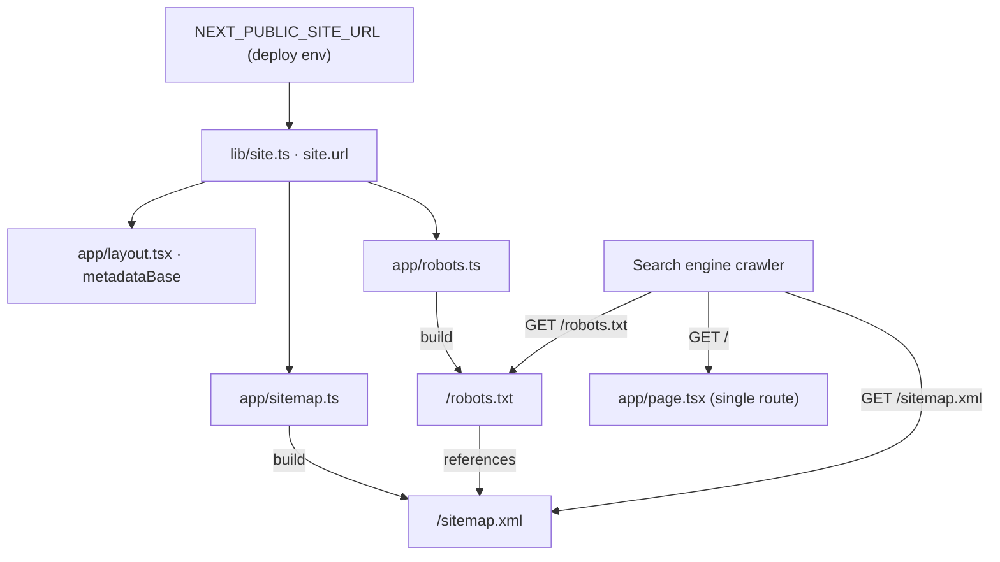

# Blueprint — sitemap.xml & robots.txt

Feature: `sitemap-robots` · Arc: `seo` · Stack: Next.js 16.2.6 (App Router, TypeScript)

## 1. Requirements Summary

### Functional
- FR-1: Serve a valid `sitemap.xml` at `/sitemap.xml` listing the site's
  crawlable URL(s).
- FR-2: Serve a valid `robots.txt` at `/robots.txt` that (a) allows general
  crawling, (b) disallows `/api/`, and (c) references the sitemap.
- FR-3: Both artifacts derive their base URL from `site.url` (`lib/site.ts`) —
  no hardcoded domains.

### Non-functional
- NFR-1 (Correctness): Output must conform to the sitemap protocol and robots
  exclusion standard; `Content-Type` set by the framework.
- NFR-2 (Maintainability): Zero new dependencies; idiomatic Next file
  conventions; each file has a single responsibility.
- NFR-3 (Consistency): Base URL identical to `metadataBase` in `app/layout.tsx`
  (both read `site.url`).
- NFR-4 (Build cost): Statically generated at build time; negligible.

### Constraints
- Next 16 breaking-change risk → implementer reads `node_modules/next/dist/docs/`
  before coding (AGENTS.md).
- Single-route app: only `/` is a real document; anchors are not separate URLs.
- `site.url` falls back to `https://portfolio.local` unless
  `NEXT_PUBLIC_SITE_URL` is set (deploy-time env contract — pre-existing).

## 2. Key Trade-offs

### T1 — File convention vs. custom route handler
- **A. `app/sitemap.ts` / `app/robots.ts` (MetadataRoute)**: typed, framework
  serves at canonical path, auto `Content-Type`, statically cached. Con: must
  match Next 16's exact API.
- **B. `app/sitemap.xml/route.ts` hand-building XML**: full control. Con: manual
  XML + headers, untyped, more surface for bugs, no framework caching semantics.
- **Recommendation: A.** Idiomatic, minimal, typed. B solves a problem we don't
  have.

### T2 — Sitemap scope: root only vs. root + anchors
- **A. Root URL only**: matches reality — one document. Clean.
- **B. Root + `#work`, `#philosophy`, …**: looks richer. Con: fragments dedupe to
  the same page; crawlers ignore them — pure noise.
- **Recommendation: A.** List `/` only. Revisit if independently-routed pages
  appear.

### T3 — Base URL source: `site.url` import vs. static `public/` files
- **A. Import `site.url`**: single source of truth; honors `NEXT_PUBLIC_SITE_URL`
  override at build.
- **B. Static `public/robots.txt` + `public/sitemap.xml`**: zero code. Con:
  hardcoded domain, drifts from metadata, breaks env override.
- **Recommendation: A.** Preserving the single source of truth is the explicit
  task goal.

## 3. Architectural Design

### 3.1 Core Components
| Component | Single Responsibility | Technology | Notes |
|-----------|----------------------|------------|-------|
| `app/sitemap.ts` | Emit the URL set for `/sitemap.xml` | Next `MetadataRoute.Sitemap` default export | Imports `site.url`; returns one entry (root) |
| `app/robots.ts` | Emit crawl rules + sitemap pointer for `/robots.txt` | Next `MetadataRoute.Robots` default export | Imports `site.url`; disallows `/api/` |
| `lib/site.ts` (existing) | Single source of truth for URL/identity | TS const | **Unchanged** — consumed, not modified |

No component holds state; both files are pure functions of `site.url` evaluated at
build time. Nothing to scale (static assets).

### 3.2 Data Flow



### 3.3 Interfaces (contracts)

**`app/sitemap.ts`** — default export `(): MetadataRoute.Sitemap`
Returns an array with a single entry:
```
[
  {
    url: site.url,               // e.g. https://portfolio.local (or prod domain)
    lastModified: <Date>,        // build-time Date — reflects last deploy
    changeFrequency: "monthly",  // portfolio changes infrequently
    priority: 1                   // sole/primary page
  }
]
```
Served at: `GET /sitemap.xml` → `Content-Type: application/xml` (framework-set).

**`app/robots.ts`** — default export `(): MetadataRoute.Robots`
Returns:
```
{
  rules: { userAgent: "*", allow: "/", disallow: "/api/" },
  sitemap: `${site.url}/sitemap.xml`
}
```
Served at: `GET /robots.txt` → `Content-Type: text/plain` (framework-set).

Expected latency: static asset — sub-millisecond served from cache/CDN.

### 3.4 Observability
Static build-time artifacts — no runtime metrics/logs/traces required. Verify
post-build:
- Build log shows both routes emitted (`○ /sitemap.xml`, `○ /robots.txt`).
- Manual/E2E check: `curl` (or Playwright request) `GET /sitemap.xml` and
  `/robots.txt` return 200 with correct `Content-Type` and contain `site.url`.
- Optional: validate sitemap against the schema; confirm `robots.txt` lists the
  sitemap line.

### 3.5 Deploy
No pipeline change. Artifacts are generated by the existing `next build` and
served as static routes. Production correctness depends on `NEXT_PUBLIC_SITE_URL`
being set at build time (same contract as `metadataBase`) — call this out in the
deploy checklist. Release strategy unchanged (whatever the site already uses).

## 4. Implementation Notes (for developer-agent)
1. **Read `node_modules/next/dist/docs/`** for the Next 16 sitemap & robots file
   conventions and the exact `MetadataRoute` field names before writing.
2. Import `{ site }` from `@/lib/site` in both files (path alias already used
   across the repo, e.g. `app/layout.tsx`).
3. Type both default exports with `MetadataRoute.Sitemap` / `MetadataRoute.Robots`
   from `next`.
4. Keep `lastModified` deterministic-friendly: a build-time `new Date()` is
   acceptable (reflects deploy time). If the project prefers reproducible builds,
   source a fixed date constant instead — note the choice in the changelog.
5. Do **not** modify `lib/site.ts` — it is consumed only.
6. Do **not** add `public/robots.txt` or `public/sitemap.xml` (would conflict
   with / shadow the generated routes).

## 5. Acceptance (summary)
- `/sitemap.xml` → 200, `application/xml`, contains `<loc>` = `site.url`.
- `/robots.txt` → 200, `text/plain`, contains `Allow: /`, `Disallow: /api/`, and
  `Sitemap: ${site.url}/sitemap.xml`.
- Both reflect `NEXT_PUBLIC_SITE_URL` when set at build.
- `next build` and typecheck pass; no new dependency added.
